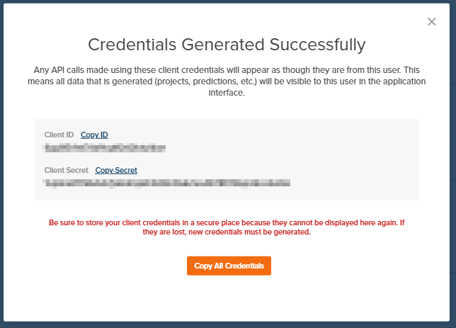

.. _authentication_oauth2:

#######################
API Authentication
#######################

PlantPredict uses the `Amazon Cognito & OAuth 2.0 API <https://docs.aws.amazon.com/cognito/latest/developerguide/what-is-amazon-cognito.html>`_
for administering and managing access tokens. If you are a first time user of the PlantPredict API, you need a set of
client credentials (client ID, and client secret).

Step 1: Generate/receive client credentials.
======================================================

"I have never used PlantPredict and need an account".
------------------------------------------------------

Simply navigate to https://ui.plantpredict.com/signUp, provide the necessary information and complete your account registration.

"I have a PlantPredict account and am the company administrator."
------------------------------------------------------------------

If you are the only person with a PlantPredict account in your organization/company, or the first person to have an
account, you are likely the company admin. If you are a company admin, you will have a gear icon next to your
name on the very bottom-left of the page when you log in on a web browser.

Click the gear icon. On the next page, search for the name of the person you would like to generate client credentials
for, and click on their name.

.. image:: _images/search_for_name.png
    :align: center

Click on "Generate API Credentials" on the top right of the next page.

.. image:: _images/generate_api_credentials_button.png
    :align: center

Copy each credential to your clipboard to be stored securely (step 2).

"I have a PlantPredict account but am not the company administrator."
---------------------------------------------------------------------

Contact the person in your organization who is the company admin, and provide to them a link to this page.

Step 2: Store your API credentials securely.
==============================================

Step 3: Authenticate and receive a token.
=========================================

At the beginning of any script/Python session, execute the following code to authenticate with the PlantPredict servers
to generate an access token, which is stored on an :py:class:`~plantpredict.api.Api` object.

.. code-block:: python

    import plantpredict

    api = plantpredict.Api(
        client_id="INSERT CLIENT_ID FROM API CREDENTIALS",
        client_secret="INSERT CLIENT_SECRET FROM API CREDENTIALS"
    )

The :py:class:`~plantpredict.api.Api` object is then used to instantiate other PlantPredict entities (see
:ref:`example_usage`).

.. warning::

    The access token will expire after 1 hour. If your script requires more than one hour to complete, the SDK will
    automatically generate a new token using a refresh token.